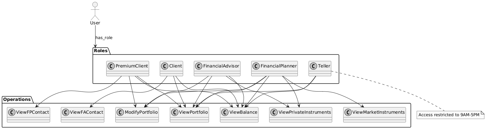

# Problem 1

### (a) Access Control Model Selection

Role-Based Access Control (RBAC) was chosen for the justInvest system because:
- It naturally maps to the organizational structure with clearly defined roles (Client, Premium Client, Financial Advisor, Financial Planner, Teller)
- Permissions are grouped by role, making it easier to manage and maintain
- It supports the hierarchical nature of the access requirements where employees have base permissions plus role-specific ones
- It efficiently handles the time-based access restrictions for Tellers through role-specific rules

### (b) Access Control Design Sketch




### (c) Test Coverage Description

The implementation was tested using comprehensive test cases that cover:

1. **Role Permission Verification**:
- Client permissions (view-only access)
- Premium Client extended permissions
- Financial Advisor investment modification capabilities
- Financial Planner full access rights
- Teller restricted access

2. **Time-Based Access Control**:
- Teller access during business hours (9AM-5PM)
- Access denial outside business hours
- Multiple time points tested (8AM, 9AM, 2PM, 4PM, 5PM, 8PM)

3. **Permission Isolation**:
- Cross-role permission verification
- Ensuring roles cannot access unauthorized operations
- Testing denied operations for each role

4. **Input Validation**:
- Invalid role handling
- Invalid operation handling
- Null input handling

5. **Edge Cases**:
- Role initialization verification
- Permission set completeness
- Permission isolation between roles

# Problem 2

### (a) Hash Function Selection

The implementation uses PBKDF2-HMAC-SHA256 with the following parameters:
- **Hash Algorithm**: SHA-256 (provides strong cryptographic security)
- **Salt Length**: 32 bytes (256 bits, providing sufficient randomness against rainbow table attacks)
- **Iterations**: 100,000 (balances security with performance)
- **Salt Generation**: os.urandom() (cryptographically secure random number generator)

This combination was chosen because:
- PBKDF2 is designed specifically for password hashing
- SHA-256 provides strong cryptographic security without excessive computational overhead
- The iteration count provides protection against brute-force attacks
- The salt length prevents pre-computation attacks

### (b) Password File Structure

The password file uses JSON-formatted records, one per line. Example record:
```json
{
    "username": "testuser",
    "salt": "5a2d8f3e1c7b9a4d6...",  // 32-byte salt in hex
    "hash": "7f4e2d1a8c5b9f3e6...",  // Password hash in hex
    "role": "Client"                  // User's role
}
```

Components justification:
- **username**: Unique identifier for user lookup
- **salt**: Unique per-user salt to prevent rainbow table attacks
- **hash**: Salted and hashed password for secure storage
- **role**: User's role for access control integration

### (c) Implementation Overview

The implementation provides two main functions:
1. `add_user(username, password, role)`: Creates new user records
2. `verify_user(username, password)`: Authenticates users

Key security features:
- Input validation
- Duplicate username prevention
- Secure file handling
- Exception handling

### (d) Test Coverage

The test suite provides comprehensive coverage through:

1. **File Management Tests**:
- Password file creation
- Custom file path handling
- File integrity verification

2. **Password Security Tests**:
- Salt uniqueness verification
- Hash consistency checking
- Password verification with same salt

3. **User Management Tests**:
- Successful user addition
- Duplicate username prevention
- Empty input handling
- Case sensitivity verification

4. **Concurrent Access Tests**:
- Multiple instance handling
- File locking verification
- Data consistency checks

# Problem 3

### (a) User Interface Design

The enrollment interface was designed with minimalism and security in mind, collecting only essential information:

1. **Required Information**:
- Username (unique identifier)
- Password (with proactive checking)
- Role selection (from predefined options)

2. **Interface Flow**:
```
=== justInvest User Enrollment ===
Enter username: [user input]
Available roles:
- Client
- Premium Client
- Financial Advisor
- Financial Planner
- Teller
Enter role: [user input]
Enter password: [user input]
Confirm password: [user input]
```

### (b) Proactive Password Checker Implementation

The password checker enforces the following security requirements:

1. **Length Requirements**:
- Minimum: 8 characters
- Maximum: 12 characters

2. **Complexity Rules**:
- At least one uppercase letter
- At least one lowercase letter
- At least one numerical digit
- One special character from: !, @, #, $, %, *, &

3. **Security Measures**:
- Username matching prevention
- Common password detection
- Case-sensitive validation
- Extensible weak password list

### (c) Test Coverage

The test suite provides comprehensive coverage through multiple test categories:

1. **Password Validation Tests**:
```python
test_cases = [
    ("Short1!", False),           # Length validation
    ("NoDigits!", False),         # Digit requirement
    ("no_uppercase1!", False),    # Uppercase requirement
    ("NO_LOWERCASE1!", False),    # Lowercase requirement
    ("NoSpecialChar1", False),    # Special character requirement
    ("Valid@Pass1", True)         # Valid password
]
```

2. **Username Matching Tests**:
```python
username_tests = [
    ("testuser123!", False),      # Contains username
    ("TestUser123!", False),      # Case-insensitive match
    ("Secure123!@", True)         # Valid password
]
```

3. **Enrollment Flow Tests**:
- Successful enrollment
- Duplicate username prevention
- Invalid role handling
- Password confirmation
- Empty input handling

4. **Edge Cases**:
- Whitespace handling
- Special character validation
- Password confirmation mismatch
- Case sensitivity checks

The test coverage ensures:
- All password requirements are enforced
- User input is properly validated
- Security measures are effective
- Error handling is comprehensive
- Edge cases are properly handled

# Problem 4

### (a) Login Interface Design

The login interface implements a simple yet secure authentication flow:

```
=== justInvest Login ===
Username: [user input]
Password: [user input]
```

Key implementation features:
- Input validation for empty fields
- Integration with PasswordManager for verification
- Clear error messaging
- Secure credential handling

### (b) Access Privileges Display

Upon successful authentication, the system displays:

```
=== User Information ===
Username: [authenticated username]
Role: [user role]

Access Privileges:
- [list of permitted operations]
```

The implementation:
- Retrieves role-specific permissions
- Displays operations in sorted order
- Integrates with AccessControl system
- Provides clear permission visibility

### (c) Test Coverage

The test suite provides comprehensive coverage through:

1. **Authentication Tests**:
```python
test_cases = [
    ("testuser", "Test123!@", True),    # Valid credentials
    ("testuser", "WrongPass", False),   # Invalid password
    ("nonexistent", "Test123!@", False) # Unknown user
]
```

2. **Role-Based Permission Tests**:
- Client access rights verification
- Premium Client extended permissions
- Financial Advisor capabilities
- Financial Planner full access
- Teller time-restricted access

3. **Interface Testing**:
```python
test_scenarios = [
    ('testuser', 'Test123!@', True),     # Successful login
    ('', 'Test123!@', False),            # Empty username
    ('testuser', '', False),             # Empty password
    ('nonexistent', 'Test123!@', False)  # Invalid user
]
```

4. **Edge Cases**:
- Invalid input handling
- Session management
- Multiple login attempts
- Permission display verification

The test coverage ensures:
- Proper authentication
- Correct permission assignment
- Accurate privilege display
- Robust error handling
- Security policy enforcement